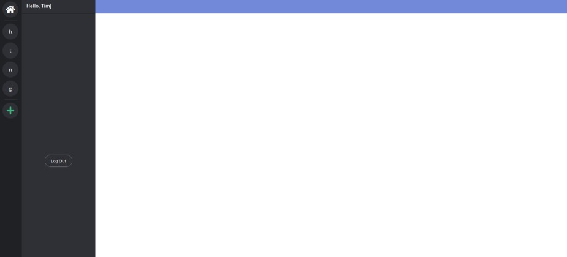

# Dunder

Dunder, a Discord clone, is a chatting application that allows a user to talk to friends and strangers about anything they want using themed channels and servers

[Live Demo](https://erised-app.herokuapp.com/#/)

## Technologies
* Backend: Rails/ActiveRecord/PostgreSQL
* Frontend: React/Redux
* [Action Cable] (https://github.com/rails/rails/tree/master/actioncable)
* [type.js] (https://github.com/mattboldt/typed.js/)

## Features
* Secure frontend to backend user authentication using BCrpyt
* Allows users to create and delete their own personal servers
* Allows users to join and leave other people's servers
* Live text chat and retrieval of old chat messages within the same server

### Servers
Once a user is logged in, the list of servers that they have joined is displayed. 
 
 

 
 

There are options to create a brand new server or join a pre-existing server.
 
 

 
 

A user can also delete a server if they own it and leave a server if they do not.
 
 

 
 

### Live Chat
Live chat 

