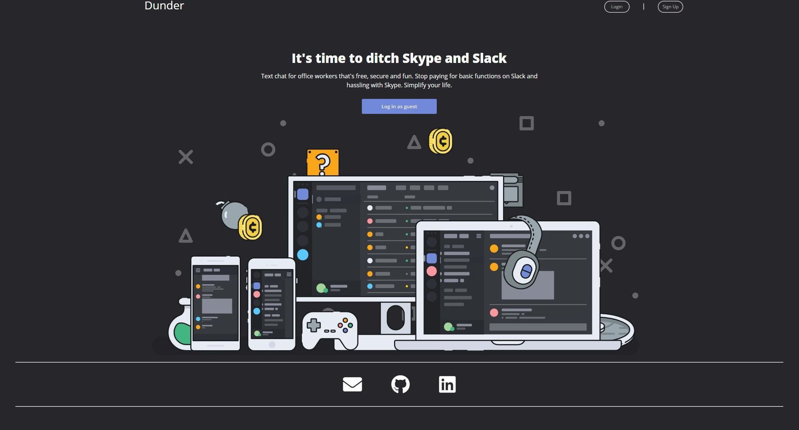
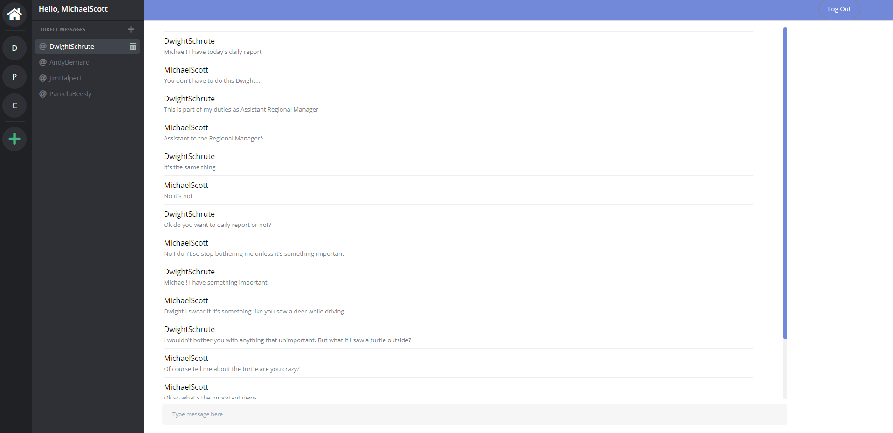
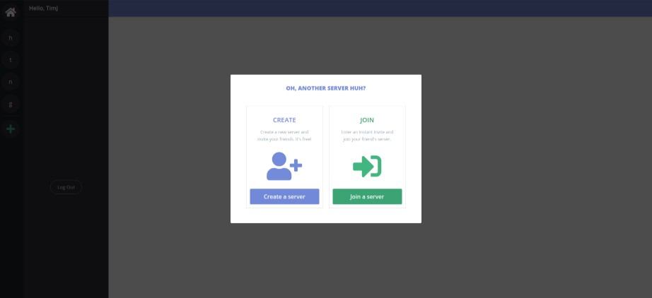

# Dunder

Dunder, a Discord clone, is a chatting application that allows a user to talk to friends and strangers about anything they want using themed channels and servers

[Live Demo](https://erised-app.herokuapp.com/#/)

## Technologies
* Backend: Rails/ActiveRecord/PostgreSQL
* Frontend: React/Redux
* [Action Cable](https://github.com/rails/rails/tree/master/actioncable)

## Features
* Secure frontend to backend user authentication using BCrpyt
* Allows users to create and delete their own personal servers
* Allows users to join and leave other people's servers
* Live text chat and retrieval of old chat messages within the same server

### Wireframe
The landing page allows you to login, signup or browse as a guest
 
 

 
 

Once a user is logged in, the list of servers that they have joined is displayed. In addition, the user can see and open any Direct Messages that were sent or received
 
 

 
 

The user can open up servers, enter channels and chat with other users. The messages are saved specifically for that channel.
 
 

 
 

There are options to create a brand new server or join a pre-existing server.
 
 

 
 

A user can also delete a server if they own it and leave a server if they do not.
 
 

 
 

