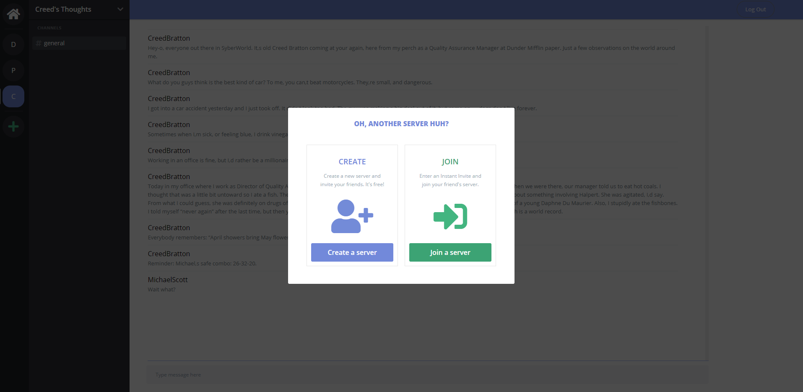

# Dunder

Dunder, a Discord clone, is a chatting application that allows a user to talk to friends and strangers about anything they want using themed channels and servers

[Live Demo](https://dunder-app.herokuapp.com/#/)

## Technologies
* Backend: Rails/ActiveRecord/PostgreSQL
* Frontend: React/Redux
* [Action Cable](https://github.com/rails/rails/tree/master/actioncable)

## Features
* Secure frontend to backend user authentication using BCrpyt
* Allows users to create and delete their own personal servers
* Allows users to join and leave other people's servers
* Live text chat and retrieval of old chat messages within the same server

### Wireframe
The landing page allows you to login, signup or browse as a guest
<br />
<br />

<br />
<br />

Once a user is logged in, the list of servers that they have joined is displayed. In addition, the user can see and open any Direct Messages that were sent or received
<br />
<br />

<br />
<br />

The user can open up servers, enter channels and chat with other users. The messages are saved specifically for that channel.
<br />
<br />

<br />
<br />

There are options to create a brand new server or join a pre-existing server.
<br />
<br />

<br />
<br />

A user can also delete a server if they own it and leave a server if they do not.
<br />
<br />

<br />
<br />

Likewise, channels can be created and deleted but only by the owner of the server

### Code
One of the key functions of this website is a live chat. The main snippets of code that handles most of the logic are shown below.

Backend(Ruby):
```Ruby
class ChatChannel < ApplicationCable::Channel  

  def subscribed
    parent = Channel.find(params[:parent_id])
    stream_for parent
  end

  def speak(data)
    parent = Channel.find(params[:parent_id])
    message = Message.new(
      message: data['message'], 
      sender_id: data['sender_id'],
      parent_id: data['parent_id']
    )
    if message.save!
      user = User.find(message.sender_id)
      socket = { message: message, user: {username: user.username}, type:'message' }
      ChatChannel.broadcast_to(parent, socket)
    end
  end

  def load
    parent = Channel.find(params[:parent_id])
    messages = Message.where(parent_id: parent.id)
    socket = { messages:messages, type:'messages' }
    ChatChannel.broadcast_to(parent, socket)
  end

  def unsubscribed
    # Any cleanup needed when channel is unsubscribed
  end
end
```

Frontend(Javascript):

```JS
createSocket(){
        this.server = App.cable.subscriptions.create(
            {
                channel: "ChatChannel",
                parent_id: this.props.parentId,
                sender_id: this.props.senderId
            },
            {
                received: data => {
                    switch (data.type) {
                        case "message":
                            let temp = this.state.messages
                            temp.push(data);
                            this.setState({messages: temp})
                            break;
                        case "messages":
                            this.setState({ messages: data.messages });
                            break;
                    }
                },
                speak: function (data) {
                    return this.perform("speak", data);
                },
                load: function () {
                    return this.perform("load") 
                }
            }
        );
}
```

Another important part of my website is the User Authentication. Below is the model of the User class in the backend which is integral in creating a new account and logging in.

Backend(Ruby):
```Ruby
class User < ApplicationRecord

    attr_reader :password
    
    #validations for new users
    
    validates :username, :password_digest, :session_token, presence: true
    validates :username, uniqueness: true
    validates :password, length: {minimum: 6, allow_nil: true}

    #after creating a new user, it will automatically set a session token. Session tokens are used to determine whether or not a user is logged in if/when they change pages
    after_initialize :ensure_session_token

    #will find a user based on the password and username given
    def self.find_by_credentials(username, password)
        user = User.find_by(username:username)
        if user && user.is_password?(password)
            return user
        end
        nil
    end

    #sets a password. Rather than storing the password that the user inputs, we will use the BCrypt hashing function to create a secure password digest that will be near-impossible to guess
    def password=(password)
        @password = password
        self.password_digest = BCrypt::Password.create(password)
    end

    #converts string to a hash and compares it to the one stored in the database
    def is_password?(password)
        BCrypt::Password.new(self.password_digest).is_password?(password)
    end

    #resets the user's session token on new login
    def reset_session_token!
        self.session_token ||= SecureRandom.urlsafe_base64
        self.save!
        self.session_token
    end

    def ensure_session_token
        self.session_token ||= SecureRandom.urlsafe_base64
    end

    
end
```
    

